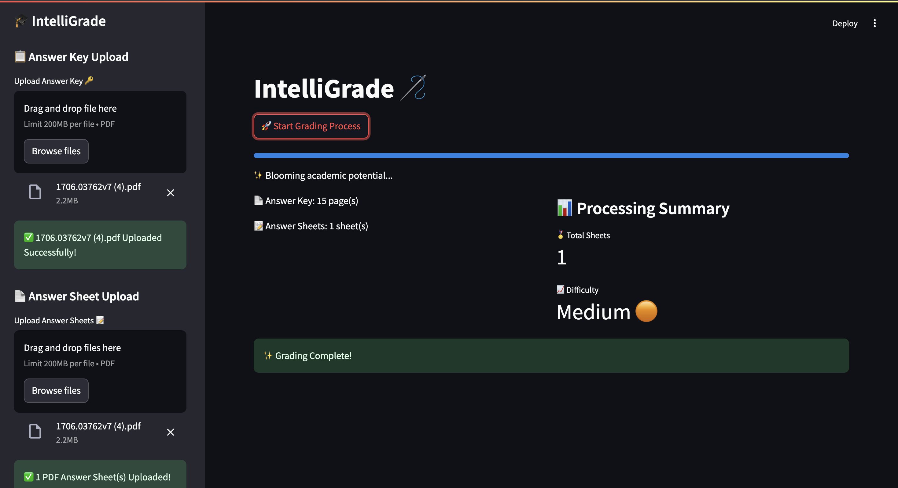

# IntelliGrade

A powerful AI system for intelligent handwritten answer script evaluation, combining speed, accuracy, and reliability using Google's Gemini 1.5 Flash model for visual question answering and handwriting OCR.

---

## Flow


---
## Frontend

## Setup

### Clone the Repository
```bash
git clone https://github.com/ShiroYasha18/ibm_dpk-project
cd ibm_dpk-project
```

### Set Up Virtual Environment

#### For Windows:
```bash
python -m venv venv
.\venv\Scripts\activate
```

#### For macOS/Linux:
```bash
python3 -m venv venv
source venv/bin/activate
```

### Install Requirements
```bash
pip install -r requirements.txt
```

### Get Google Generative AI API Key
1. Go to [Google Cloud Console](https://console.cloud.google.com/).
2. Enable the Generative AI API.
3. Generate an API key from the "Credentials" section.
4. Copy your API key.

### Set Up Environment Variables
1. Create a file named `.env` in the project root directory.
2. Add the API key to the file:
   ```env
   GOOGLE_API_KEY="your_api_key_here"
   ```

### Run the Application
```bash
python image_processor.py
```

---

## Requirements

For a full list of dependencies, see the `requirements.txt` file.

---

## Notes
- The AI utilizes Google's Gemini 1.5 Flash model, a powerful tool within the Generative AI API, for both visual question answering and accurate handwriting OCR.
- Keep your `.env` file confidential and never commit it to version control.
- Supported image formats: PNG, JPEG.
- Exclude the `venv` folder from version control.

---

## Troubleshooting
- Ensure your virtual environment is activated.
- Verify your Google Generative AI API key is correct.
- Check the location of your `.env` file.
- Make sure all dependencies are installed correctly.

---

## Contributing
1. Fork the repository.
2. Create a feature branch:
   ```bash
   git checkout -b feature/AmazingFeature
   ```
3. Commit your changes:
   ```bash
   git commit -m 'Add some AmazingFeature'
   ```
4. Push to the branch:
   ```bash
   git push origin feature/AmazingFeature
   ```
5. Open a Pull Request.

---

## License
This project is licensed under the MIT License. See the `LICENSE` file for details.
