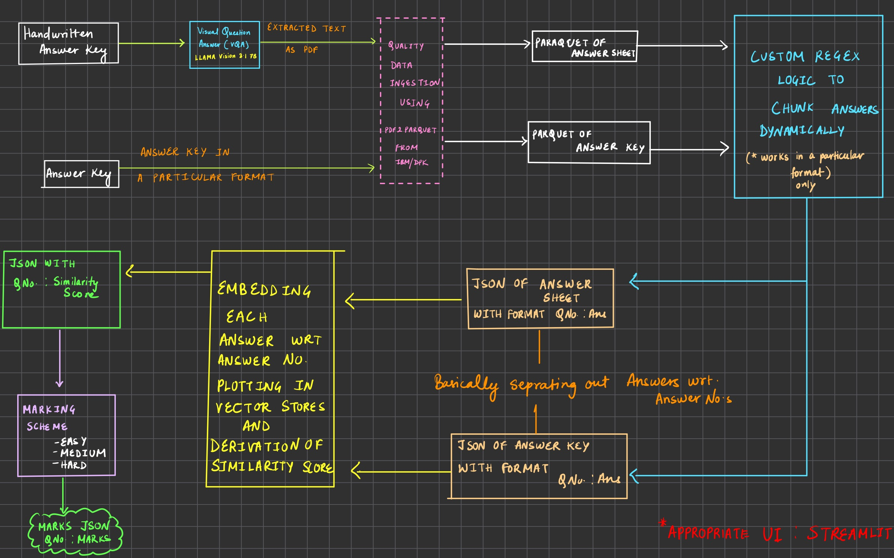

# IntelliGrade

 A powerful AI system for intelligent answer script evaluation, combining speed, accuracy, and reliability.
 ## Flow
 

### 1. Clone the Repository

```bash
git clone https://github.com/yourusername/Tanishta15/ibm_dpk-proj
>>>>>>> b6fc94e422b66db0b0f477d27a1b991ec854afc7
cd ibm_dpk-proj
```

### 2. Set Up Virtual Environment

For Windows:
```bash
python -m venv venv
.\venv\Scripts\activate
```

For macOS/Linux:
```bash
python3 -m venv venv
source venv/bin/activate
```

### 3. Install Requirements

```bash
pip install -r requirements.txt
```

## Requirements

See `requirements.txt` for a full list of dependencies

## Notes

- Keep your `.env` file private and never commit it to version control
- Make sure your images are in a supported format (JPEG, PNG)
- The virtual environment folder (`venv`) should also be excluded from version control

## Troubleshooting

If you encounter issues:
1. Ensure your virtual environment is activated
2. Verify your Groq API key is correct
3. Check that your `.env` file is in the correct location
4. Make sure all dependencies are installed correctly

## Contributing

1. Fork the repository
2. Create your feature branch (`git checkout -b feature/AmazingFeature`)
3. Commit your changes (`git commit -m 'Add some AmazingFeature'`)
4. Push to the branch (`git push origin feature/AmazingFeature`)
5. Open a Pull Request

## License

This project is licensed under the MIT License - see the LICENSE file for details
